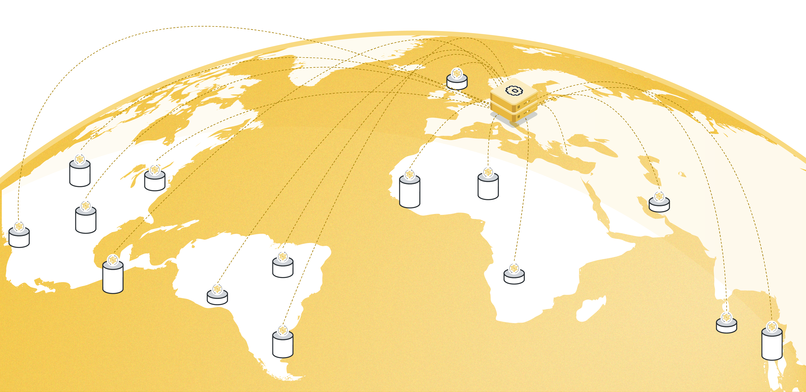

<p align="center"></p>

# Federated Fine-Tuning Blueprint with Flower

Large language models (LLMs), which have been trained on vast amounts of publicly accessible data, are great.

However, the availability of high-quality public data is decreasing. Federated AI enables multiple data owners to collaboratively fine-tune models **without sharing raw data**, unlocking access to distributed private datasets.

This blueprint demonstrates **Federated Fine-Tuning of LLMs** using [Flower](https://flower.ai), a framework for federated learning. We fine-tune **Qwen2-0.5B-Instruct model** on the **Alpaca-GPT4 dataset** using **PEFT-based LoRA adapters**.

<p align="center">
  
</p>

### 👉 📖 For detailed guidance, visit our [Docs here](https://mozilla-ai.github.io/federated-finetuning/)

---

## 📋 Pre-requisites
- System requirements:
	- OS: Linux
	- Python 3.10 or higher
	- Minimum RAM: 8GB (recommended for LLM fine-tuning)
	- All dependencies are listed in `pyproject.toml`.

## 🚀 Quick Start

### 1️⃣ Clone the Project
```bash
git clone https://github.com/mozilla-ai/blueprint-federated-finetuning.git
cd blueprint-federated-finetuning
```

### 2️⃣ Update submodule and install dependencies
```bash
pip install -e .  # Install root project dependencies
```

### 3️⃣ Run Federated Fine-Tuning with Flower

You can run your Flower project in both simulation and deployment mode without making changes to the code. If you are starting with Flower, we recommend you using the simulation mode as it requires fewer components to be launched manually. By default, `flwr run` will make use of the Simulation Engine. We have provided you with a `run.sh` script for this Blueprint. The default model that runs is FL simulations with a 4-bit [Qwen2-0.5B-Instruct](https://huggingface.co/Qwen/Qwen2-0.5B-Instruct) model involving 2 clients per rounds for 100 FL rounds. You can override configuration parameters by either change them in `pyproject.toml` or directly when calling the `flwr run .`.

#### Run with the Simulation Engine (Recommended)
> \[!NOTE\]
> Check the [Simulation Engine documentation](https://flower.ai/docs/framework/how-to-run-simulations.html) to learn more about Flower simulations and how to optimize them.

```bash
flwr run .

# Run for 10 rounds but increasing the fraction of clients that participate per round to 25%
flwr run . --run-config "num-server-rounds=10 strategy.fraction-fit=0.25"
```

### Run with the Deployment Engine

Follow this [how-to guide](https://flower.ai/docs/framework/how-to-run-flower-with-deployment-engine.html) to run the same app in this example but with Flower's Deployment Engine. After that, you might be interested in setting up [secure TLS-enabled communications](https://flower.ai/docs/framework/how-to-enable-tls-connections.html) and [SuperNode authentication](https://flower.ai/docs/framework/how-to-authenticate-supernodes.html) in your federation.

If you are already familiar with how the Deployment Engine works, you may want to learn how to run it using Docker. Check out the [Flower with Docker](https://flower.ai/docs/framework/docker/index.html) documentation.



### Test Your Fine-Tuned Model

To generate text responses from your trained model:
```bash
python demo/generate_response.py --peft-path=/path/to/trained-model \
    --question="What is the ideal 1-day plan in London?"
```

## 🎭 Interactive Demo: Streamlit App

We provide a Streamlit web demo for testing the fine-tuned model in real time. This assumes that you have ssh:ed into remote machine.

### Run the Demo
```bash
streamlit run demo/app.py --server.address=0.0.0.0 --server.port=8501 -- --model-path <MODEL_PATH> # <FLOWERTUNE-LLM-REPO><RESULTS><TIMESTAMP><PEFT_#>
```
Once running, open your browser and go to:
```bash
https://localhost:8501
```
Here, you can input a question and receive model-generated responses.

### Local Fine-Tuning

Local fine-tuning involves training a model on a **single dataset partition** instead of multiple federated clients. This provides a **baseline** for evaluating the effectiveness of federated fine-tuning. The process follows these steps:

1. **Dataset Selection:** The dataset is loaded and split into smaller partitions to mimic client data distributions. A single partition (1/n of the full dataset) is used for training.
2. **Model Configuration:** A **4-bit quantized model** is loaded and prepared using **PEFT-based LoRA adapters**.
3. **Training:** The model is fine-tuned on the assigned dataset partition using `SFTTrainer`.
4. **Evaluation:** The resulting model is tested and compared against federated fine-tuned models to assess performance differences.

Local fine-tuning is executed using:
```bash
python src/fine-tune-local.py
```
After training, the fine-tuned model is stored in `results/` for later evaluation.

We also provide `./demo/run.sh` that runs federated fine-tuning with default settings, and thereafter local fine-tuning. It will then test both fine-tuned models on benchmark data.

## Expected results


## Device Resources

You can adjust the CPU/GPU resources you assign to each of the clients based on your device.
For example, it is easy to train 2 concurrent clients on each GPU (8 GB VRAM) if you choose 0.5-billion model.
Assigning 50% of the GPU's VRAM to each client by setting `options.backend.clientapp-gpus = 0.5` under `[tool.flwr.federations.local-simulation]` in `pyproject.toml`.

## 🛠️ How It Works

This project integrates:
1. __Dataset Handling__ - Uses Flower Datasets to download, partition, and preprocess the dataset.
2. __Model Fine-Tuning__ - Uses the PEFT library to fine-tune Qwen2-0.5B-Instruct model. It also supports LoRA adapters to make fine-tuning efficient and lightweight.
3. __Federated Training via Flower__ - Uses Flower’s Simulation Engine to orchestrate training across distributed clients, and allows fine-tuning on a single GPU by running simulations.

### Project Structure
```
federated-finetuning-blueprint
├── src/
│   ├── flowertune-llm/
│   │   ├── client_app.py    # Defines the Flower client
│   │   ├── server_app.py    # Defines the Flower server
│   │   ├── dataset.py       # Handles data loading and preprocessing
│   │   ├── models.py        # Defines the fine-tuning models
│   ├── benchmarks/general-nlp/
│   │   ├── benchmarks.py    # Defines benchmarks
│   │   ├── eval.py          # Evaluates the fine-tuned model
│   │   ├── utils.py         # Useful functions
│   ├── fine-tune-local.py   # Fine-tunes a local model
│   ├── plot_results.py      # Visualization script
│
├── demo/
│   ├── generate_response.py  # Script to generate model responses
│   ├── app.py                # Run streamlit demo
│
├── pyproject.toml  # Project metadata and dependencies
```

## ❓ Troubleshooting
### Installation Issues:
Ensure dependencies are installed:
```bash
pip install -e .
```

### CUDA Issues:
If running on GPU, verify CUDA installation:
```bash
python -c "import torch; print(torch.cuda.is_available())"
```

### Slow Training:
- Lower num-server-rounds in pyproject.toml.

## 📜 License

This project is licensed under the Apache 2.0 License. See the LICENSE file for details.

🤝 Contributing

Contributions are welcome!
To get started, check out the CONTRIBUTING.md file.
